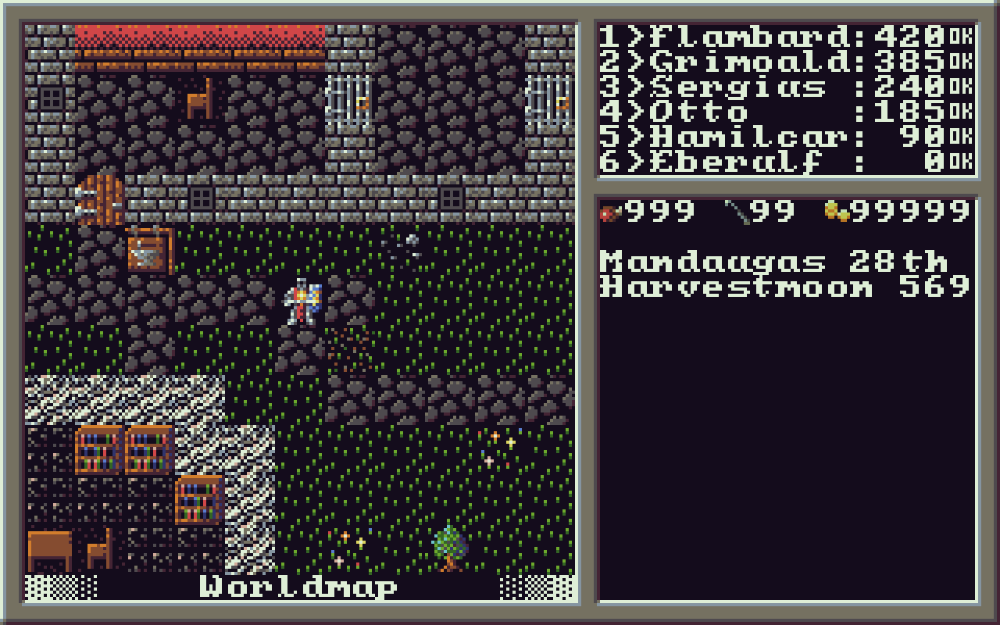

DWEMRAKRAFTAZ
=============

Archaic DOS-style RPG in the spirit of old Ultima games, in glorious faux EGA (modified palette of 16 colors) and 320x200 resolution.
Written in C, using libtcod roguelike library for rendering and input.

Libraries used:

[ini](http://github.com/rxi/ini)

[libtcod](http://bitbucket.org/libtcod/libtcod)
